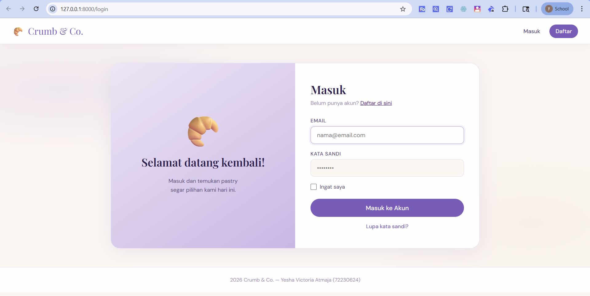
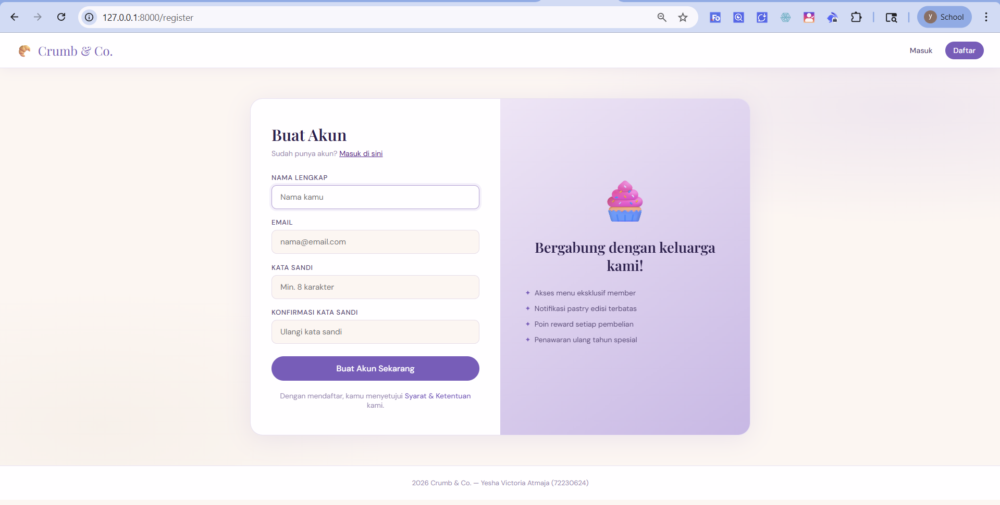
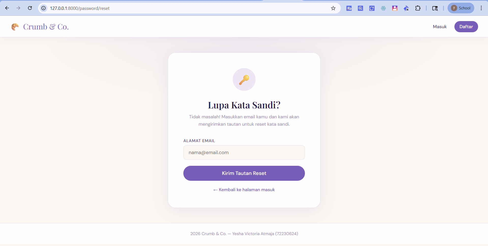
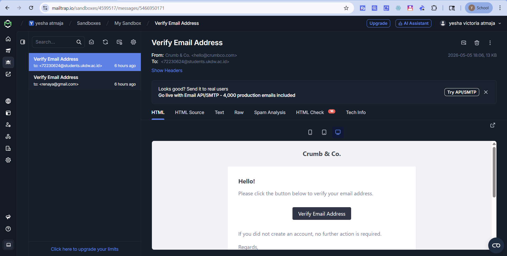
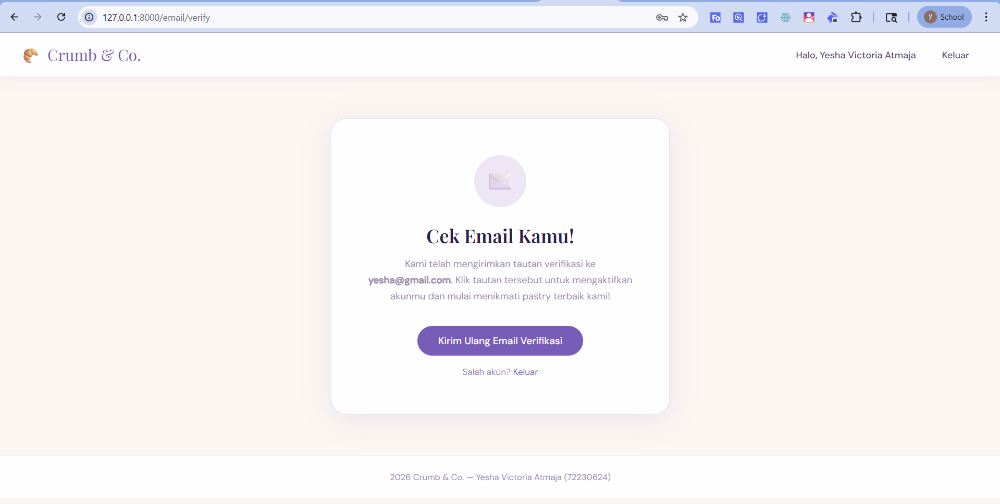
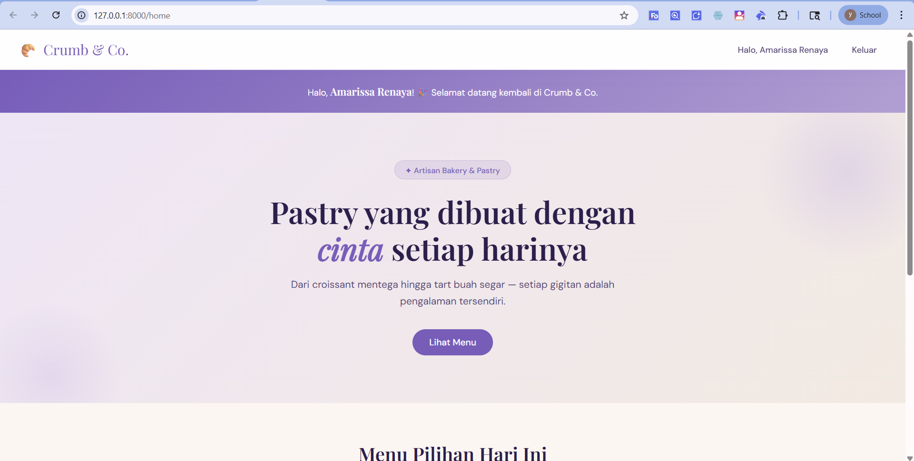
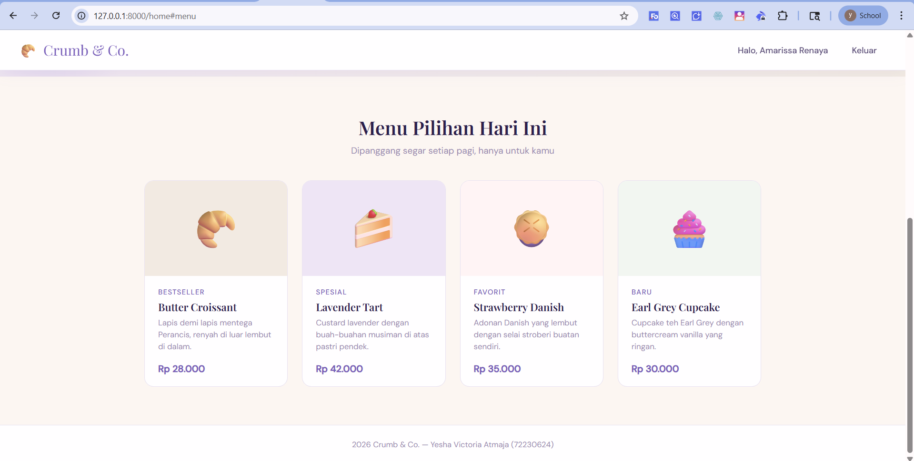
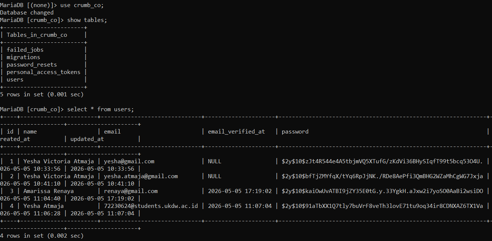

# 🥐 Crumb & Co.
## Web Aplikasi dengan Fitur Authentication (Laravel 8)
By : Yesha Victoria Atmaja (72230624)

## 📌 Deskripsi

Project ini merupakan implementasi **sistem authentication** pada aplikasi web toko roti pastry bernama **Crumb & Co.**

Aplikasi ini menggunakan desain **modern minimalist** dengan color palette: Ungu Lilac, Putih, dan Cream.

Sistem dibangun menggunakan Laravel 8 (compatible dengan PHP 7.3.33) dan berfokus pada **keamanan data pengguna serta pengalaman user yang sederhana dan elegan**.

Project ini dibuat untuk memenuhi tugas mata kuliah **Keamanan Sistem Informasi**.

---

## ✨ Fitur Sistem

* Login
* Registrasi
* Password Hashing (bcrypt)
* Konfirmasi Registrasi (Email Verification)
* Password Reset (Lupa Password)

---

## 🔒 Implementasi Keamanan

### 1. Password Hashing

Password pengguna tidak disimpan dalam bentuk asli, melainkan di-hash menggunakan **bcrypt** dari Laravel.

Contoh:

```php
Hash::make($request->password);
```

---

### 2. Email Verification
Setelah registrasi, user wajib melakukan verifikasi email sebelum dapat mengakses sistem.

Menggunakan fitur:

```php
MustVerifyEmail
```

---

### 3. Password Reset

Pengguna dapat melakukan reset password melalui email dengan sistem token yang aman.

Fitur ini menggunakan:

* Forgot Password
* Reset Password Controller Laravel

---

## ⚙️ Teknologi yang Digunakan

* Laravel 8
* PHP 7.3.33
* Composer 2.3.7
* MySQL / MariaDB
* Bootstrap (UI Modern Minimalist)
* Mailtrap (Testing Email)

---

## 🚀 Cara Menjalankan Project

### 1. Clone Repository

```bash
git clone https://github.com/yesha-23/Crumbco-ksi.git
cd Crumbco-ksi
```

---

### 2. Install Dependency

```bash
composer install
npm install
```

---

### 3. Copy File Environment

```bash
cp .env.example .env
```

---

### 4. Konfigurasi File .env

```env
DB_DATABASE=crumb_co
DB_USERNAME=root
DB_PASSWORD=
```

---

### 5. Generate Application Key

```bash
php artisan key:generate
```

---

### 6. Jalankan Migration

```bash
php artisan migrate
```

---

### 7. Build Frontend

```bash
npm run dev
```

---

### 8. Jalankan Server

```bash
php artisan serve
```

---

## 📧 Konfigurasi Email (Mailtrap)

Project ini menggunakan **Mailtrap** untuk testing:

* Verifikasi email
* Reset password

### Langkah-langkah:

1. Buka: [https://mailtrap.io](https://mailtrap.io)
2. Buat akun
3. Masuk ke **Email Sandbox**
4. Ambil SMTP credentials

---

### Konfigurasi `.env`:

```env
MAIL_MAILER=smtp
MAIL_HOST=sandbox.smtp.mailtrap.io
MAIL_PORT=2525
MAIL_USERNAME=ISI_USERNAME
MAIL_PASSWORD=ISI_PASSWORD
MAIL_ENCRYPTION=tls
MAIL_FROM_ADDRESS=crumbco@mail.com
MAIL_FROM_NAME="Crumb & Co."
```

---

## 🧪 Testing Sistem

1. Register akun baru
2. Cek email di Mailtrap
3. Verifikasi akun
4. Login
5. Coba fitur:
   * Logout
   * Forgot Password
   * Reset Password

## ⚠️ Catatan
1. Pastikan sudah menginstall:
   * PHP >= 7.3
   * Composer
   * Node.js & NPM
   * MySQL / MariaDB
2. File .env tidak disertakan dalam repository (untuk keamanan), jadi wajib dibuat dari .env.example

---------------------------------
## TAMPILAN APLIKASI WEB "Crumb & Co."
### Halaman Login


### Halaman Daftar/Registrasi


### Halaman Reset Password


### Verification Email


### Halaman Verification Email


### Halaman Home


### Halaman Home/Menu


### Password telah di Hash
